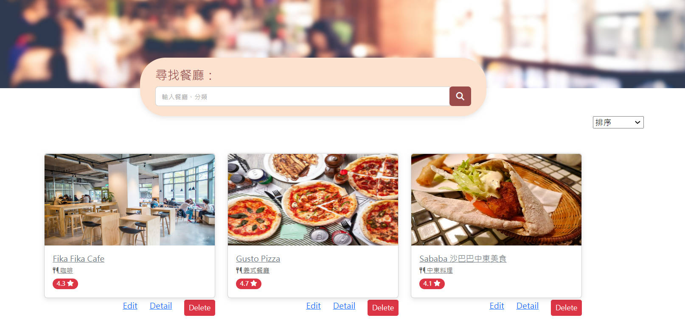

# My Restaurant List
記錄自己的餐廳清單
## 主要功能
- 首頁可以查看所有餐廳簡介
- 搜尋欄可以依名稱、餐廳類別搜尋特定餐廳
- 新增清單
- 瀏覽清單
- 修改清單
- 刪除清單
- 排序清單

### Screen Photos
#### 首頁

#### 餐廳詳情

## Get Start
1. 確保已安裝好Node.js
2. 透過終端輸入指令將此專案clone到你的本機 : 
   `git clone https://github.com/AlanSquid/restaurant-list.git`
3. 在專案資料夾內安裝npm套件 : 
   `npm install `
4. 執行:
  `npm run start`
5. 執行成功終端會顯示: Express is listening on http://localhost:3000 
6. 欲結束執行可在終端輸入`ctrl + C`

## 開發工具
- Node.js v16.17.0
- Express 4.18.2
- express-handlebars 6.0.6
- Bootstrap 5.2
- method-override ^3.0.0
- mongoose ^6.6.7

  

