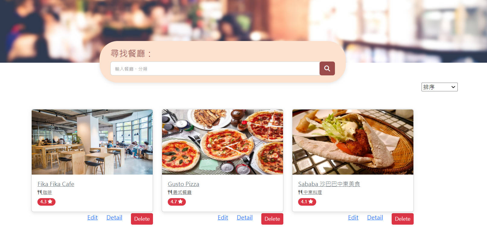
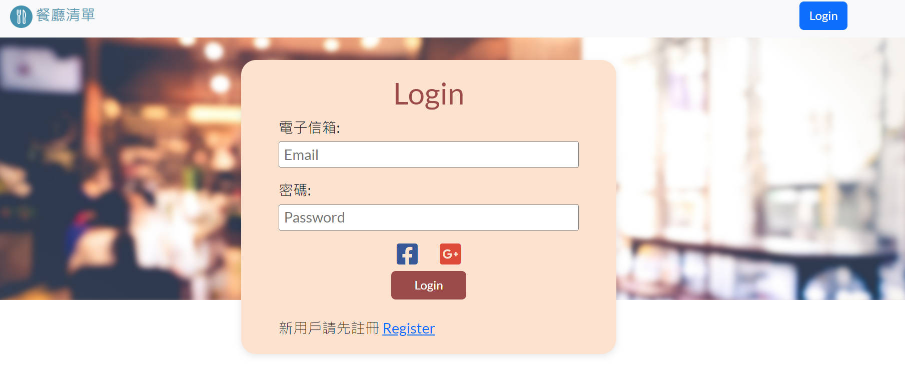

# My Restaurant List
記錄自己的餐廳清單

## 主要功能
- 首頁可以查看所有餐廳簡介
- 搜尋欄可以依名稱、餐廳類別搜尋特定餐廳
- 新增清單
- 瀏覽清單
- 修改清單
- 刪除清單
- 排序清單

## 使用者驗證
需註冊，並登入使用
有提供第三方登入:
- Facebook
- Google

### Screen Photos
#### 首頁

#### 餐廳詳情

#### 登入驗證

## Get Start
1. 確保已安裝好Node.js

2. 透過終端輸入指令將此專案clone到你的本機 : 
   `git clone https://github.com/AlanSquid/restaurant-list.git`

3. 在專案資料夾內安裝npm套件 : 
   `npm install `

4. 環境變數設定請參考.env.example

5. 執行:
  `npm run start`

6. 執行成功終端會顯示: Express is listening on http://localhost:3000 

7. 建立種子資料請在終端輸入: `npm run seed` 
   帳密:
   - user1@example.com, 12345678
   - user2@example.com, 12345678

8. 欲結束執行可在終端輸入`ctrl + C`

  

